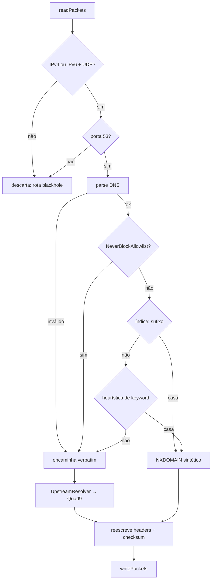

# Bloqueios iOS

Documentação da arquitetura de bloqueio de sites e apps de aposta no iOS.

Substitui `BLOQUEIO_APOSTAS_IOS.md`, que descreve a arquitetura anterior
(`NEDNSProxyProvider`) e está obsoleto.

---

## 1. Por que a arquitetura mudou

A implementação anterior usava **`NEDNSProxyProvider`**. Ela **nunca funcionou em
nenhum iPhone de consumidor**, e não por bug de configuração: a Apple restringe
configurações de DNS Proxy a aparelhos **supervisionados/MDM**. Num iPhone
pessoal, `NEDNSProxyManager.saveToPreferences` falha com
`NEConfigurationErrorDomain` código 10 e a extensão nunca é lançada.

Três defeitos escondiam a falha e faziam o app mentir para o usuário:

| Onde | Defeito |
|---|---|
| `BlockingManager.enableDNSProxy()` | erro do `saveToPreferences` só ia para um `print` |
| `BlockingManager.applyBlocking()` | chamava `completion(true)` assim que a blocklist baixava, antes de o túnel sequer tentar subir |
| `enableDNSProxy()` | nunca definia `localizedDescription`, o que reprova o save mesmo em aparelho supervisionado |

Havia ainda um **segundo showstopper independente**: o normalizador de domínios
não removia o `^` da sintaxe AdGuard. Como **100% das ~311 mil linhas** da
blocklist terminam em `^`, a validação de charset reprovava todas, e o
bloqueador rodava com os 5 domínios do fallback compilado.

E um terceiro: `syncAuthSession` / `clearAuthSession` estavam implementados no
Swift mas **não exportados** no `.m`. Como o JS usa optional chaining, as chamadas
sumiam em silêncio — o enforcement de assinatura no iOS nunca executou, em
nenhuma versão.

---

## 2. Arquitetura

Quatro camadas, da mais forte para a mais fraca:

| # | Mecanismo | Cobre | Sem MDM? |
|---|---|---|---|
| 1 | `NEPacketTunnelProvider` (túnel local de DNS) | ~302 mil domínios em **todos** os navegadores e apps | ✅ |
| 2 | FamilyControls / ManagedSettings shield | Apps nativos de aposta | ✅ (autorização `.individual`) |
| 3 | Rotas blackhole + nomes DoH no índice | Resolvers criptografados | ✅ |
| 4 | Passcode do Tempo de Uso + restrição de VPN | Impede o próprio usuário de desligar | ⚠️ só o usuário configura |

É a mesma abordagem de AdGuard, Lockdown Privacy e 1Blocker — caminho já
aprovado na App Store.

### O túnel captura apenas DNS

```
includedRoutes = 198.18.0.2/32, fd6e:a81b:704f:1211::2/128 + IPs de DoH
excludedRoutes = 0.0.0.0/0, ::/0
```

Nenhum tráfego do usuário entra no túnel. Isso importa para bateria, privacidade
e principalmente para a defesa na App Review: não somos uma VPN de tráfego, e as
rotas provam isso.

Endereços da faixa **RFC 2544** (`198.18.0.0/15`) de propósito: nunca é roteada
na internet pública e, ao contrário de `10/8` ou `192.168/16`, não colide com a
LAN de casa nem com CGNAT de operadora.

**IPv6 não é opcional.** Vivo, Claro e TIM rodam IPv6/NAT64 amplamente; num
trecho IPv6-only, um túnel só-IPv4 vaza todas as queries em silêncio.

### Fluxo de uma consulta



---

## 3. Mapa de arquivos

```
ios/Shared/                     compilado nos DOIS targets
  SharedConstants.swift         app group, chaves, endereços, upstreams
  DomainNormalizer.swift        porta de BlockedDomainsRepository.normalizeDomain
  DomainHash.swift              FNV-1a 64 — contrato entre escritor e leitor
  BlocklistFormat.swift         layout do blocklist.v1.bin
  GamblingKeywordMatcher.swift  porta de KeywordMatcher.kt, como scanner de bytes
  NeverBlockAllowlist.swift     nossa infra — trava de segurança
  DefaultBlockedDomains.swift   fallback compilado (~30 domínios)
  DoHEndpoints.swift            hostnames e IPs de DNS criptografado

ios/PacketTunnel/               a extensão
  PacketTunnelProvider.swift    ciclo de vida, network settings, laço de pacotes
  IPPacket.swift                parse/síntese IPv4, IPv6, UDP, checksums
  DNSMessage.swift              parse de query, NXDOMAIN, truncamento
  UpstreamResolver.swift        pool de NWConnection + remapeamento de txid
  BlocklistIndex.swift          leitor mmap + busca binária + sufixo
  CircuitBreaker.swift          disjuntor → modo passthrough

ios/BetHunter/Blocking/         lado do app
  BlockingManager.swift         orquestra shields + túnel, propaga Result
  TunnelController.swift        NETunnelProviderManager, on-demand, pause
  TunnelHealthMonitor.swift     reconcilia estado real × intenção
  BlocklistStore.swift          escritor do índice (só o app constrói)
  BlocklistSyncService.swift    download com ETag/retry/guardas
  SubscriptionEnforcementTask   BGTask, verified:true, pausa (não remove)
  BetBlockingModule.swift/.m    bridge React Native
  BlockingControlView.swift     UI nativa de controle
  BlockingFlowCoordinator.swift autorização + primeira seleção
  AppGroupHelper.swift          UserDefaults compartilhado

scripts/
  verify-ios-blocking.sh        suíte que roda sem aparelho
  check-rn-bridge.sh            Swift ↔ .m devem casar
```

> **Nunca** adicione `AppGroupHelper.swift` ao target da extensão: ele importa
> `FamilyControls`, que a extensão não pode linkar. Constantes compartilhadas
> vivem em `SharedConstants.swift`.

---

## 4. O índice de blocklist

### Por que não SQLite

1. **`0xdead10cc`.** Um packet tunnel provider é suspenso rotineiramente pelo SO.
   Processo suspenso segurando lock de arquivo em container compartilhado é morto
   com esse código — exatamente o cenário de SQLite num App Group. O Android não
   tem esse problema, por isso `BlockedDomainsDb.kt` é adequado lá e não aqui.
2. **Memória.** NE providers têm ~15 MB. 302.750 × 8 B = **2,31 MB de memória
   limpa e file-backed**: só as páginas tocadas pela busca binária ficam
   residentes, e o kernel pode despejá-las sem matar o processo.
3. **Zero escrita na extensão** — sem lock, WAL, journal ou busy timeout.
4. **Velocidade:** medido em **472 ns/consulta**, contra ~20 µs do SQLite.

### Formato `blocklist.v1.bin`

```
off  tam  campo
  0    4  magic "BHBL"
  4    2  versão do formato (UInt16 LE)
  6    2  flags (bit 0 = ordenado)
  8    8  entryCount (UInt64 LE)
 16    8  builtAt (unix seconds)
 24    8  hashSeed (offset basis do FNV-1a)
 32   32  SHA-256 do texto baixado
 64  n*8  entradas: UInt64 LE, estritamente crescentes
```

Header de 64 bytes mantém o array alinhado a 8 e 16 bytes, então o leitor faz
`bindMemory(to: UInt64.self)` e indexa direto. Little-endian é nativo em arm64.

Qualquer inconsistência (magic, versão, tamanho, seed) faz o leitor tratar o
arquivo como **ausente** e cair no fallback compilado. Nunca fail-open total.

### Escrita atômica

```
Set<UInt64> → sort() → .tmp no MESMO diretório → replaceItemAt → bump generation
```

O bump da generation é o **último** passo: só depois de o arquivo estar no lugar
a extensão pode ser instruída a reabrir o mmap. Como `replaceItemAt` troca o
inode, um mmap já aberto continua lendo o arquivo antigo e autoconsistente — não
é preciso `NSFileCoordinator`.

> **`FileProtectionType.none` é obrigatório e load-bearing.** Com on-demand
> ligado o túnel sobe antes do primeiro desbloqueio pós-reboot; com `.complete` o
> índice viria vazio. O conteúdo é uma blocklist pública — zero valor de
> privacidade.

### Casamento por sufixo

Para `a.b.exemplo.com` testa `a.b.exemplo.com`, `b.exemplo.com`, `exemplo.com`.
Um domínio armazenado bloqueia todos os filhos. **Nunca testa TLD puro** — um
"com" na lista derrubaria a internet inteira. Teto de 8 iterações.

---

## 5. Invariantes que não podem ser quebradas

| Invariante | Por quê |
|---|---|
| `DomainHash` usa FNV-1a, **nunca** `String.hashValue` | `Hasher` do Swift é semeado por processo; app e extensão divergiriam em silêncio |
| `protectionEnabled` é escrito **só** em `BlockingManager` | escrever antes de o túnel conectar persiste uma mentira se houver crash |
| Upstream nunca pode estar no blackhole | o túnel ficaria incapaz de resolver qualquer coisa (há assert em `DoHEndpoints`) |
| Falha de upstream → **descarta**, nunca NXDOMAIN | senão uma queda de rede vira bloqueio total da internet |
| A extensão **nunca** baixa nem constrói o índice | 311 mil linhas em 15 MB é jetsam garantido |
| ETag gravado **só** após validar o corpo inteiro | senão o próximo 304 fixa o app numa lista truncada para sempre |
| `isOnDemandEnabled = false` **antes** de `stopVPNTunnel()` | senão o on-demand religa e a pausa vira no-op |
| Todo `@objc func` precisa de `RCT_EXTERN_METHOD` | senão o método não existe para o JS e falha em silêncio |

---

## 6. Ordem de avaliação

```
1. NeverBlockAllowlist   → encaminha (prioridade máxima)
2. índice, por sufixo    → NXDOMAIN
3. heurística de keyword → NXDOMAIN
4. senão                 → encaminha
```

**`NeverBlockAllowlist` é trava de segurança, não conveniência.** O keyword
matcher bloqueia qualquer domínio com "stake", "blaze", "casino" ou "aposta". Um
falso positivo na nossa infra tijolaria o app: sem API, sem RevenueCat (o usuário
perderia o acesso que pagou), sem refresh da blocklist — e para ele o sintoma
seria "o BetHunter parou de funcionar".

**Ao adicionar domínio à infraestrutura, adicione a `NeverBlockAllowlist.swift`.**

---

## 7. Disjuntor

O pior desfecho não é "não bloqueia" — é **"o iPhone ficou sem internet"**. O
usuário não associa a causa, culpa a operadora e desinstala.

| Gatilho | Ação |
|---|---|
| 20 falhas consecutivas de upstream | modo passthrough |
| taxa de sucesso < 10% em ≥ 50 consultas | passthrough + `tunnel_degraded` + notificação |
| canário `dns.quad9.net` responde | volta a filtrar |

Em passthrough o túnel continua de pé, só para de filtrar. **O shield de apps
continua ativo**, então nunca se cai a zero de proteção.

Complementos: `removeBlocking()` funciona sempre (com escotilha para Ajustes ›
VPN) e há **kill switch remoto** via `setTunnelEnabled(false)`.

---

## 8. Pausa por assinatura

Paridade com os commits `99f718b2` / `2f7ac372` do Android.

```
enum PremiumCheck { case active, expired, unknown }
```

`unknown` cobre erro de rede, status ≠ 200, JSON malformado **e**
`verified != true`. Ausência de informação nunca é prova de não-assinatura.

- `.active` → retoma se estava pausado
- `.expired` → **pausa**, mantendo `protectionEnabled = true` e a task agendada
- `.unknown` → não faz nada

`pauseBlocking` ≠ `stopBlocking`: a pausa preserva a intenção e a seleção de
apps, e religa sozinha na renovação. `stopBlocking` é só para a ação explícita do
usuário.

---

## 9. Matriz de bypass (honesta)

| Tentativa | Bloqueia? | Como |
|---|---|---|
| Reboot, crash, modo avião, "Desconectar" em Ajustes | ✅ | on-demand religa |
| Apagar o perfil de VPN em Ajustes | ⚠️ | só com Tempo de Uso › Restrições › VPN: Não Permitir |
| Apagar o app | ⚠️ | só com Modo Rígido (`denyAppRemoval`) |
| Outro app de VPN | ❌ | iOS roda uma VPN por vez; on-demand briga quando a outra cai |
| iCloud Private Relay | ❌ | resolve pelo próprio canal; mitigado parcialmente por NXDOMAIN em `mask*.icloud.com` |
| DoH do Chrome/Firefox | ✅ | **não existe no iOS** — App Store força WKWebView e a stack do sistema |

**A ação de maior alavancagem é o passcode do Tempo de Uso com a restrição de
VPN, guardado por um terceiro de confiança.** É o equivalente consumidor da
supervisão MDM, e o app não consegue ativá-la sozinho — só o usuário. O fluxo
guiado está em `BlockingControlView`.

---

## 10. Cobertura em produção

| Camada | Cobertura | Observação |
|---|---|---|
| Compatibilidade técnica | **100%** | iOS 16+; aparelhos anteriores nem recebem o app |
| Ativação | 2 consentimentos | alerta de VPN e Tempo de Uso, **independentes** |
| Eficácia contínua | ver §9 | |

Recusar o Tempo de Uso não derruba o bloqueio de sites, e vice-versa. Como a taxa
de aceitação dos dois alertas determina o valor entregue, o onboarding é parte do
produto: explicar **antes** de disparar cada alerta, e instrumentar as duas taxas
separadamente.

---

## 11. Testar

### Sem aparelho

```bash
./scripts/verify-ios-blocking.sh
npx tsc --noEmit
```

Resultado esperado:

```
==> bridge React Native ......... 12 métodos exportados corretamente
==> blocklist real .............. 311.019 linhas
==> blocklist e índice .......... 302.750 entradas, 2.31 MB, ~470 ns/consulta
==> pacote IP e DNS ............. ~60 asserções
==> type-check PacketTunnel ..... OK
==> type-check camada do app .... OK
```

### Com iPhone físico

Simulador **não** roda packet tunnel.

Console.app → selecione o iPhone → filtre por `com.bethunter.app`. Em build de
DEBUG cada consulta aparece:

```
DNS #1 v4 apple.com qtype=65 -> forward (bloqueadas: 0)
DNS #2 v4 bet365.com qtype=1 -> NXDOMAIN (bloqueadas: 1)
```

Checklist, em ordem de risco:

1. `bet365.com` falha, `google.com` funciona — repetir em Safari, Chrome, Edge, Firefox
2. `dig -t HTTPS bet365.com` → NXDOMAIN (regressão do qtype 65 / ECH)
3. **Rede IPv6-only / NAT64** — o modo de falha que quebra em silêncio no Brasil
4. Handoff Wi-Fi → LTE no meio da navegação
5. Reboot e navegar **sem abrir o app** (valida on-demand + `FileProtectionType.none`)
6. Instruments na extensão + flood de consultas → bem abaixo de 15 MB
7. Ajustes › VPN › Desconectar → on-demand religa
8. Pausa por assinatura → o túnel **fica** caído; retomada → volta com os shields

> Em build de **release** nada sobre domínios acessados é registrado. O log de
> consultas é `#if DEBUG` — é o que sustenta a afirmação de privacidade nas notas
> de review.

---

## 12. Operação

**Rollout:** flag `ios_tunnel_enabled` do backend, lida no `didBecomeActive`.
TestFlight interno → 5% → geral. Métrica de parada: qualquer relato de "sem
internet", ou taxa de passthrough acima de zero.

**Atualizar a blocklist:** automático a cada 24 h via `BlocklistRefreshTask`, com
ETag condicional. `refreshBlockedDomains()` força pelo JS.

**Trocar a fonte da lista:** `BlocklistSyncService.sourceURL`. O portão de
aproveitamento de parsing (`minimumParseYield = 0.5`) rejeita automaticamente uma
lista cujo formato mudou, preservando o índice anterior — é a guarda que teria
pego o bug do `^` sozinha.

---

## 13. Referências

- `docs/APP_REVIEW_NOTES.md` — pré-requisitos da Apple e notas de submissão
- `android/.../BetBlockerVpnService.kt` — implementação equivalente no Android
- `docs/BLOQUEIO_APOSTAS_IOS.md` — arquitetura anterior (obsoleta)
