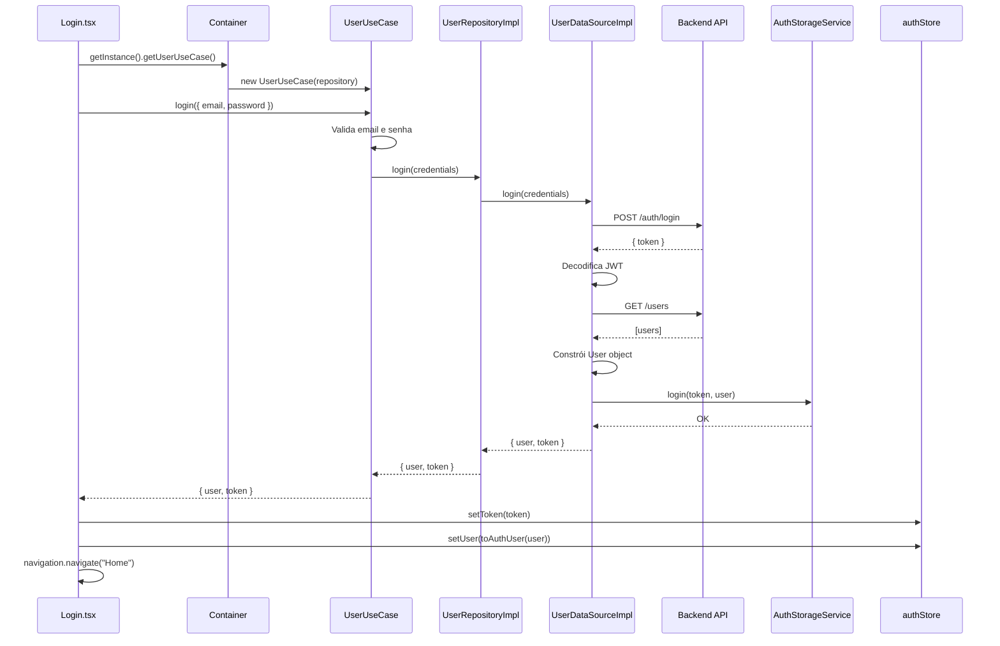

# Documentação: Implementação do Serviço de Login

## Visão Geral

Este documento descreve a implementação completa do serviço de login seguindo os princípios da **Clean Architecture**. A implementação garante separação de responsabilidades, testabilidade e manutenibilidade do código.

---

## Estrutura Implementada

### Arquitetura em Camadas

```
src/
├── domain/                    # REGRAS DE NEGÓCIO (sem dependências externas)
│   ├── entities/
│   │   └── User.ts            # ✅ Atualizado com interfaces necessárias
│   ├── errors/
│   │   └── CustomErrors.ts    # ✅ Criado
│   ├── repositories/
│   │   └── UserRepository.ts  # ✅ Criado (interface)
│   └── usecases/
│       └── UserUseCase.ts     # ✅ Criado
│
├── data/                      # CONTRATOS E IMPLEMENTAÇÕES
│   ├── datasources/
│   │   └── UserDataSource.ts  # ✅ Criado (interface)
│   └── repositories/
│       └── UserRepositoryImpl.ts # ✅ Criado (implementação)
│
└── infrastructure/            # IMPLEMENTAÇÕES CONCRETAS
    ├── datasources/
    │   └── UserDataSourceImpl.ts # ✅ Criado
    ├── di/
    │   └── Container.ts       # ✅ Criado (Dependency Injection)
    └── storage/
        └── AuthStorageService.ts # ✅ Já existia
```

---

## Arquivos Criados/Modificados

### Domain Layer

#### 1. `domain/errors/CustomErrors.ts` (NOVO)

Classes de erro customizadas para tratamento de exceções:

```typescript
export class ValidationError extends Error {
  constructor(message: string) {
    super(message);
    this.name = "ValidationError";
  }
}

export class AuthenticationError extends Error {
  constructor(message: string = "Credenciais inválidas") {
    super(message);
    this.name = "AuthenticationError";
  }
}
```

**Uso:**

- `ValidationError`: Quando dados de entrada são inválidos (ex: email vazio)
- `AuthenticationError`: Quando credenciais são inválidas ou há erro na autenticação

---

#### 2. `domain/entities/User.ts` (MODIFICADO)

Adicionadas interfaces e funções auxiliares:

```typescript
// Interface existente
export interface User {
  id: string;
  name: string;
  email: string;
  points: number;
  betcoins: number;
  createdAt: Date;
  updatedAt: Date;
}

// NOVO: Credenciais de login
export interface UserCredentials {
  email: string;
  password: string;
}

// NOVO: Resultado do login
export interface LoginResult {
  user: User;
  token: string;
}

// NOVO: Usuário para authStore (sem timestamps)
export interface AuthUser {
  id: string;
  name: string;
  email: string;
  points: number;
  betcoins: number;
}

// NOVO: Helper para conversão
export function toAuthUser(user: User): AuthUser {
  return {
    id: user.id,
    name: user.name,
    email: user.email,
    points: user.points,
    betcoins: user.betcoins,
  };
}
```

---

#### 3. `domain/repositories/UserRepository.ts` (NOVO)

Interface do repositório (contrato):

```typescript
export interface UserRepository {
  login(credentials: UserCredentials): Promise<{ user: User; token: string }>;
  getCurrentUser(): Promise<User | null>;
}
```

**Responsabilidade:** Define o contrato que todas as implementações devem seguir.

---

#### 4. `domain/usecases/UserUseCase.ts` (NOVO)

Casos de uso com regras de negócio:

```typescript
export class UserUseCase {
  constructor(private userRepository: UserRepository) {}

  async login(
    credentials: UserCredentials
  ): Promise<{ user: User; token: string }> {
    // Validações de negócio
    if (!credentials.email || !credentials.email.trim()) {
      throw new ValidationError("Email é obrigatório");
    }

    if (!credentials.password || credentials.password.length < 6) {
      throw new ValidationError("Senha deve ter no mínimo 6 caracteres");
    }

    const emailRegex = /^[^\s@]+@[^\s@]+\.[^\s@]+$/;
    if (!emailRegex.test(credentials.email)) {
      throw new ValidationError("Email inválido");
    }

    try {
      return await this.userRepository.login(credentials);
    } catch (error) {
      if (error instanceof AuthenticationError) {
        throw error;
      }
      throw new AuthenticationError("Erro ao realizar login");
    }
  }

  async getCurrentUser(): Promise<User | null> {
    return await this.userRepository.getCurrentUser();
  }
}
```

**Responsabilidade:**

- Validação de dados de entrada
- Regras de negócio (ex: senha mínima de 6 caracteres)
- Tratamento de erros
- Não conhece detalhes de implementação (HTTP, storage, etc.)

---

### Data Layer

#### 5. `data/datasources/UserDataSource.ts` (NOVO)

Interface do data source (contrato):

```typescript
export interface UserDataSource {
  login(credentials: UserCredentials): Promise<{ user: User; token: string }>;
  getCurrentUser(): Promise<User | null>;
}
```

**Responsabilidade:** Define o contrato para acesso a dados externos (API, banco, etc.).

---

#### 6. `data/repositories/UserRepositoryImpl.ts` (NOVO)

Implementação do repositório:

```typescript
export class UserRepositoryImpl implements UserRepository {
  constructor(private userDataSource: UserDataSource) {}

  async login(
    credentials: UserCredentials
  ): Promise<{ user: User; token: string }> {
    return await this.userDataSource.login(credentials);
  }

  async getCurrentUser(): Promise<User | null> {
    return await this.userDataSource.getCurrentUser();
  }
}
```

**Responsabilidade:**

- Implementa a interface `UserRepository`
- Delega para o `UserDataSource`
- Pode adicionar lógica de transformação de dados se necessário

---

### Infrastructure Layer

#### 7. `infrastructure/datasources/UserDataSourceImpl.ts` (NOVO)

Implementação concreta do data source:

```typescript
export class UserDataSourceImpl implements UserDataSource {
  constructor(private authStorageService: AuthStorageService) {}

  async login(
    credentials: UserCredentials
  ): Promise<{ user: User; token: string }> {
    // 1. Chama API de login
    const response = await apiClient.post("/auth/login", {
      email: credentials.email,
      password: credentials.password,
    });

    const { token } = response.data;

    // 2. Decodifica JWT para pegar email
    const decodedToken = jwtDecode<JWTPayload>(token);
    const userEmail =
      decodedToken.sub || decodedToken.email || credentials.email;

    // 3. Busca dados completos do usuário
    const usersResponse = await apiClient.get("/users");
    const users = usersResponse.data;
    const userData = users.find((u: any) => u.email === userEmail);

    // 4. Constrói objeto User
    const user: User = {
      id: userData?.id || "",
      name: userData?.name || "",
      email: userEmail,
      points: userData?.ranking_points || 0,
      betcoins: userData?.betcoins || 0,
      createdAt: new Date(),
      updatedAt: new Date(),
    };

    // 5. Salva no storage
    await this.authStorageService.login(token, {
      id: user.id,
      name: user.name,
      email: user.email,
      points: user.points,
      betcoins: user.betcoins,
    });

    return { user, token };
  }

  async getCurrentUser(): Promise<User | null> {
    const storedUser = await this.authStorageService.getUser();
    if (!storedUser) return null;

    return {
      id: storedUser.id,
      name: storedUser.name,
      email: storedUser.email,
      points: storedUser.points,
      betcoins: storedUser.betcoins,
      createdAt: new Date(),
      updatedAt: new Date(),
    };
  }
}
```

**Responsabilidade:**

- Integração com API (HTTP)
- Decodificação de JWT
- Persistência no storage
- Transformação de dados da API para entidades do domínio

---

#### 8. `infrastructure/di/Container.ts` (NOVO)

Container de Dependency Injection:

```typescript
export class Container {
  private static instance: Container;
  private userUseCase: UserUseCase | null = null;

  private constructor() {}

  static getInstance(): Container {
    if (!Container.instance) {
      Container.instance = new Container();
    }
    return Container.instance;
  }

  getUserUseCase(): UserUseCase {
    if (!this.userUseCase) {
      const authStorageService = new AuthStorageService();
      const userDataSource = new UserDataSourceImpl(authStorageService);
      const userRepository = new UserRepositoryImpl(userDataSource);
      this.userUseCase = new UserUseCase(userRepository);
    }
    return this.userUseCase;
  }
}
```

**Responsabilidade:**

- Singleton pattern
- Inicialização e configuração de dependências
- Fornece instâncias prontas para uso nas telas

---

### UI Layer

#### 9. `screens/Login/Login.tsx` (MODIFICADO)

Tela de login atualizada:

```typescript
const handleLogin = async (): Promise<void> => {
  if (!email.trim() || !password.trim()) {
    Alert.alert("Erro", "Preencha email e senha");
    return;
  }

  setLoading(true);
  try {
    // 1. Obtém use case do container
    const userUseCase = container.getUserUseCase();

    // 2. Executa login
    const { user, token } = await userUseCase.login({ email, password });

    // 3. Atualiza estado reativo (Zustand)
    authStore.setToken(token);
    authStore.setUser(toAuthUser(user));

    // 4. Navega para Home
    navigation.navigate("Home");
  } catch (error: any) {
    // 5. Tratamento de erros
    if (
      error instanceof ValidationError ||
      error instanceof AuthenticationError
    ) {
      Alert.alert("Erro", error.message);
    } else {
      Alert.alert("Erro", "Erro ao fazer login. Tente novamente.");
    }
  } finally {
    setLoading(false);
  }
};
```

**Responsabilidade:**

- Captura de input do usuário
- Chamada do use case
- Atualização de estado (Zustand)
- Navegação
- Tratamento de erros na UI

---

## Fluxo de Dados (Login)



---

## Dependências Utilizadas

- `jwt-decode`: Para decodificar tokens JWT
- `@react-native-async-storage/async-storage`: Para persistência local (via `AuthStorageService`)
- `axios`: Para chamadas HTTP (via `apiClient`)
- `zustand`: Para gerenciamento de estado reativo (via `authStore`)

---

## Observações Importantes

### 1. Busca de Dados do Usuário

Atualmente, após o login, fazemos `GET /users` e filtramos por email. **Idealmente**, deveria existir um endpoint `GET /users/me` que retorna os dados do usuário autenticado usando o token JWT.

**Solução temporária:**

```typescript
const usersResponse = await apiClient.get("/users");
const userData = users.find((u: any) => u.email === userEmail);
```

**Solução ideal (quando backend implementar):**

```typescript
const userResponse = await apiClient.get("/users/me");
const userData = userResponse.data;
```

### 2. Mapeamento de Campos

O backend retorna `ranking_points`, mas a entidade `User` usa `points`:

```typescript
points: userData?.ranking_points || 0, // Backend usa ranking_points, domain usa points
```

### 3. Validações

As validações estão no `UserUseCase` (camada de domínio), não na UI. Isso garante:

- Reutilização das validações
- Testabilidade
- Consistência entre diferentes pontos de uso

### 4. Tratamento de Erros

- `ValidationError`: Dados inválidos (exibido diretamente ao usuário)
- `AuthenticationError`: Credenciais inválidas (exibido diretamente ao usuário)
- Outros erros: Mensagem genérica (evita expor detalhes técnicos)

---

## Testes (Recomendações)

### 1. Unit Tests - UserUseCase

```typescript
describe("UserUseCase", () => {
  it("deve lançar ValidationError se email estiver vazio", async () => {
    const useCase = new UserUseCase(mockRepository);
    await expect(
      useCase.login({ email: "", password: "123456" })
    ).rejects.toThrow(ValidationError);
  });
});
```

### 2. Integration Tests - UserDataSourceImpl

```typescript
describe("UserDataSourceImpl", () => {
  it("deve fazer login e salvar no storage", async () => {
    const dataSource = new UserDataSourceImpl(mockStorage);
    // Mock API calls
    // Assert storage was called
  });
});
```

---

## Próximos Passos

1. **Backend**: Implementar endpoint `GET /users/me` para buscar dados do usuário autenticado
2. **Testes**: Adicionar testes unitários e de integração
3. **Error Handling**: Melhorar tratamento de erros de rede
4. **Loading States**: Adicionar estados de loading mais detalhados
5. **Refresh Token**: Implementar renovação automática de token

---

## Referências

- [Clean Architecture - Robert C. Martin](https://blog.cleancoder.com/uncle-bob/2012/08/13/the-clean-architecture.html)
- [API Documentation](../../bethunter-api/docs/API_DOCUMENTATION.md)
- [Architecture Guide](./ARCHITECTURE.md)

---

_Documentação criada em: Janeiro 2025_
_Versão: 1.0.0_
