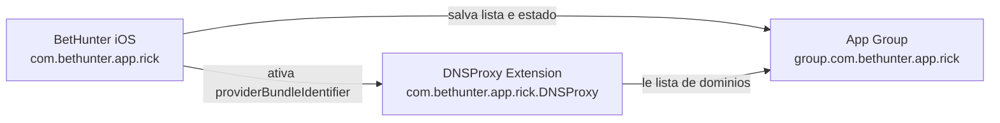

# Revisao da padronizacao do Bundle iOS

Este documento registra a padronizacao feita nos identifiers iOS do BetHunter, os pontos que podem quebrar e o checklist necessario antes de gerar build para TestFlight/App Store.

## Estado atual dos identifiers

O Android foi preservado para nao afetar a Play Store:

- Android / Play Store: `com.bethunter.app`

O iOS foi padronizado para os identifiers ja existentes no Apple Developer:

- App iOS principal: `com.bethunter.app.rick`
- Extensao iOS DNS Proxy: `com.bethunter.app.rick.DNSProxy`
- App Group iOS: `group.com.bethunter.app.rick`

O sufixo `.rick` fica apenas no identificador interno do app. Ele nao aparece como nome publico para o usuario na App Store.

## O que foi alterado

Arquivos do app mobile:

- `app.config.ts`: define `ios.bundleIdentifier` como `com.bethunter.app.rick` e mantem `android.package` como `com.bethunter.app`.
- `app.json`: define `ios.bundleIdentifier` como `com.bethunter.app.rick` e mantem Android como `com.bethunter.app`.
- `ios/BetHunter.xcodeproj/project.pbxproj`: altera o `PRODUCT_BUNDLE_IDENTIFIER` do app e da extensao DNS.
- `ios/BetHunter/BetHunter.entitlements`: altera o App Group do app principal.
- `ios/DNSProxy/DNSProxy.entitlements`: altera o App Group da extensao DNS.
- `ios/BetHunter/Blocking/AppGroupHelper.swift`: altera o `suiteName` usado pelo app principal.
- `ios/DNSProxy/DNSProxyProvider.swift`: altera o App Group lido pela extensao DNS.
- `ios/BetHunter/Blocking/BlockingManager.swift`: aponta o `providerBundleIdentifier` para `com.bethunter.app.rick.DNSProxy`.

Tambem foram alinhados os configs da raiz do workspace, caso algum comando Expo seja executado fora da pasta mobile:

- `../app.config.ts`
- `../app.json`

## Fluxo do bloqueio iOS



Para o bloqueio DNS funcionar, os tres pontos precisam bater: App ID da extensao, App Group e `providerBundleIdentifier`.

## Pontos que podem quebrar

### Assinatura iOS e build

Os provisioning profiles antigos podem deixar de funcionar. Gere novos profiles para:

- `com.bethunter.app.rick`
- `com.bethunter.app.rick.DNSProxy`

Os profiles precisam conter as capabilities corretas. Se faltar alguma capability, o build pode falhar na assinatura ou o recurso pode nao funcionar em distribuicao.

### App Group

O App Group precisa ser exatamente:

```text
group.com.bethunter.app.rick
```

Ele precisa estar:

- criado no Apple Developer;
- associado ao App ID `com.bethunter.app.rick`;
- associado ao App ID `com.bethunter.app.rick.DNSProxy`;
- presente nos entitlements do app e da extensao;
- igual nas constantes Swift que usam `UserDefaults(suiteName:)`.

Se o App Group nao bater, o app pode salvar a blocklist em um container e a extensao DNS tentar ler outro. Nesse caso, o bloqueio pode ativar, mas nao bloquear os dominios esperados.

### DNS Proxy

O app principal ativa a extensao por este identifier:

```text
com.bethunter.app.rick.DNSProxy
```

Esse valor precisa coincidir com o `PRODUCT_BUNDLE_IDENTIFIER` do target `DNSProxy` no Xcode e com o App ID no Apple Developer.

### Family Controls

O app usa FamilyControls/Screen Time para bloqueio de apps. Para distribuicao, a Apple precisa aprovar o entitlement de Family Controls para:

```text
com.bethunter.app.rick
```

Se a solicitacao foi feita para outro bundle, pode ser necessario solicitar novamente ou pedir ajuste para o bundle final.

### Network Extension

O bloqueio de dominios depende de Network Extension com DNS Proxy. Confirme no Apple Developer:

- `com.bethunter.app.rick` com `Network Extensions`;
- `com.bethunter.app.rick.DNSProxy` com `Network Extensions`;
- tipo DNS Proxy habilitado quando a interface permitir.

Se a Apple exigir aprovacao adicional, use as notas de review/suporte explicando que o app e de prevencao e autocontrole contra apostas, nao de VPN comercial nem app de apostas.

### Google Sign-In

O OAuth iOS precisa estar cadastrado para:

```text
com.bethunter.app.rick
```

O `EXPO_PUBLIC_GOOGLE_IOS_CLIENT_ID` usado no build precisa corresponder a esse OAuth Client iOS. O Android deve continuar com seu client separado para `com.bethunter.app`.

### RevenueCat

O app iOS no RevenueCat deve estar configurado com:

```text
com.bethunter.app.rick
```

Tambem confira se a chave iOS usada em producao nao e chave de teste. O Android permanece separado e deve continuar associado a `com.bethunter.app`.

### App Store Connect

Ao criar ou configurar o app no App Store Connect, selecione:

```text
com.bethunter.app.rick
```

Esse ponto e importante porque trocar bundle depois pode ser dificil ou impossivel dependendo do estado do app.

### Play Store

Nao altere o Android:

```text
com.bethunter.app
```

Trocar o package Android poderia quebrar atualizacoes futuras na Play Store.

## Checklist no Apple Developer

No Apple Developer, confirme:

- App ID `com.bethunter.app.rick` existe.
- App ID `com.bethunter.app.rick.DNSProxy` existe.
- App Group `group.com.bethunter.app.rick` existe.
- O App Group esta associado aos dois App IDs.
- `com.bethunter.app.rick` tem `App Groups`, `Network Extensions`, `Push Notifications` e `Family Controls` quando aprovado.
- `com.bethunter.app.rick.DNSProxy` tem `App Groups` e `Network Extensions`.
- Provisioning profiles novos foram gerados para app e extensao.

## Checklist externo

Antes de enviar para TestFlight/App Store:

- Google Cloud/Firebase: criar ou confirmar OAuth Client iOS para `com.bethunter.app.rick`.
- RevenueCat: configurar o app iOS com bundle `com.bethunter.app.rick`.
- App Store Connect: criar/selecionar app com bundle `com.bethunter.app.rick`.
- Politica de privacidade: mencionar bloqueio iOS, DNS Proxy, FamilyControls/Screen Time e uso da lista de dominios.
- App Review Notes: explicar que BetHunter nao oferece apostas, odds, deposito, saque, afiliacao ou redirecionamento para casas de apostas.

## Validacao recomendada

Rodar buscas para confirmar que nao restaram identifiers antigos em pontos criticos:

```bash
rg "com\\.ricardo\\.bethunter|group\\.com\\.ricardo\\.bethunter|com\\.bethunter\\.app\\.DNSProxy" BetHunter
```

Confirmar que Android continua preservado:

```bash
rg "package.*com\\.bethunter\\.app|\"package\": \"com\\.bethunter\\.app\"" BetHunter/app.config.ts BetHunter/app.json
```

Rodar type-check:

```bash
cd BetHunter
npx tsc --noEmit
```

Depois de profiles/certificados corretos, testar build iOS:

```bash
cd BetHunter
eas build --platform ios --profile production
```

## Resumo para nao quebrar

Nao misture identifiers. O conjunto oficial do iOS deve ser sempre:

```text
com.bethunter.app.rick
com.bethunter.app.rick.DNSProxy
group.com.bethunter.app.rick
```

O Android deve continuar:

```text
com.bethunter.app
```

Se algum servico externo ou provisioning profile ainda apontar para `com.ricardo.bethunter`, `com.bethunter.app`, `com.bethunter.app.ios` ou `com.bethunter.app.DNSProxy` no iOS, o build, login, paywall ou bloqueio DNS pode falhar.
